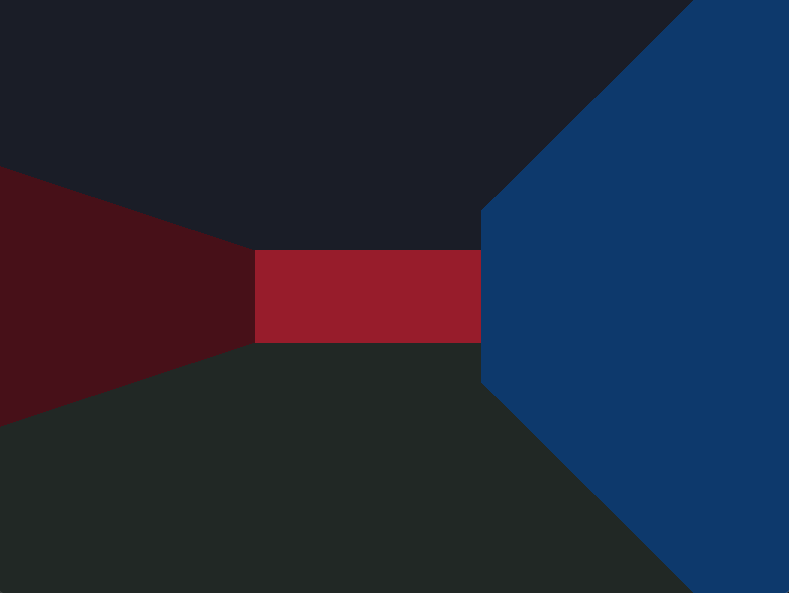
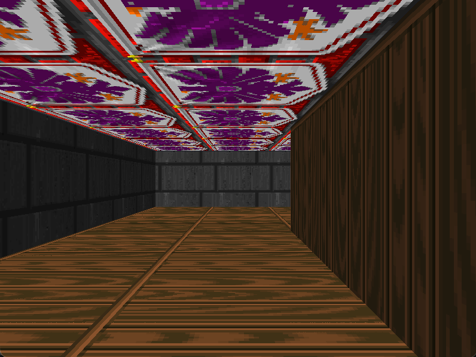

# Raycast Video Demo

Two small SDL2 raycasters you can use as a starting point:

- `src/main.c`: untextured walls, minimal baseline
- `src/textured.c`: textured walls plus textured floor/ceiling sampling the same wall textures

| Untextured | Textured |
| --- | --- |
|  |  |

## Build

Requirements: SDL2 and SDL2_image (PNG support).

- Untextured: `make run` (or `make build/raycast`)
- Textured: `make textured` (or `make build/raycast_textured`)

Textures live under `assets/sides/` (e.g. `brick.png`, `wood.png`, `eagle.png`); drop in your own 64×64 PNGs to customize. Movement is WASD/arrow keys with ESC to quit.
